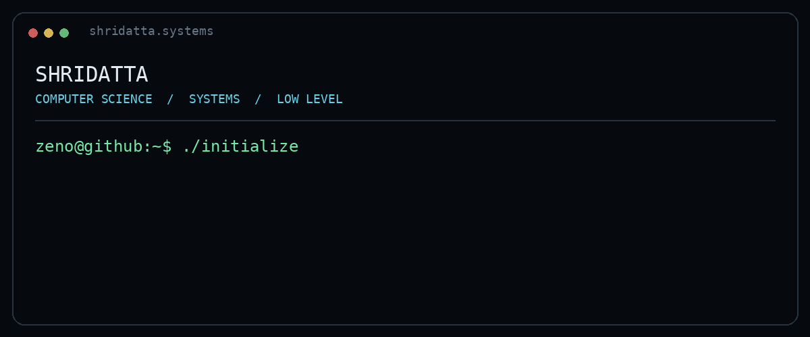
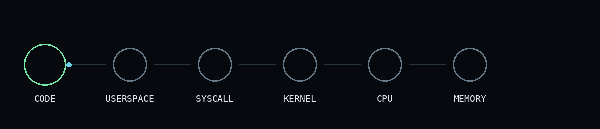

# `SHRIDATTA // SYSTEMS`

<p align="center">
  
</p>

<p align="center">
  <b>Computer Science • Operating Systems • Computer Architecture • Systems Programming</b>
</p>

<p align="center">
  <a href="https://github.com/shridattadixit06">GitHub</a>
  &nbsp; • &nbsp;
  <a href="https://www.linkedin.com/in/shridatta-dixit/">LinkedIn</a>
</p>

---

## `whoami`

```text
NAME        Shridatta
FIELD       Computer Science
INTERESTS   Operating Systems
            Computer Architecture
            Systems Programming
            Linux / UNIX
            Low-level Software
            Systems Research
```

I like understanding computers from the bottom up — not just **what** software does, but **how the machine makes it happen**.

---

## `the_layer_between`

<p align="center">
  
</p>

```text
                    ┌───────────────┐
                    │     CODE      │
                    └───────┬───────┘
                            │
                    ┌───────▼───────┐
                    │   USERSPACE   │
                    └───────┬───────┘
                            │
                         syscall
                            │
                    ┌───────▼───────┐
                    │     KERNEL    │
                    └───────┬───────┘
                            │
                  ┌─────────┴─────────┐
                  │                   │
             ┌────▼────┐         ┌────▼────┐
             │   CPU   │         │  MEMORY  │
             └─────────┘         └──────────┘
```

This is the layer of computing I'm most interested in exploring.

---

## `current_state`

```text
┌──────────────────────────────────────────────┐
│                                              │
│  OS / KERNELS                    [ ACTIVE ]  │
│  COMPUTER ARCHITECTURE           [ ACTIVE ]  │
│  SYSTEMS PROGRAMMING             [ ACTIVE ]  │
│  x86                              [ ACTIVE ]  │
│  LINUX / UNIX                     [ ACTIVE ]  │
│  SYSTEMS RESEARCH                 [ ACTIVE ]  │
│                                              │
└──────────────────────────────────────────────┘
```

### Building

**Arceon** — an educational x86 operating system.

Alongside it, I'm exploring shells, system calls, networking, tracing, and the mechanisms that connect software to the machine.

---

## `toolchain`

<p align="center">
  
</p>

```text
LANGUAGES       C • C++ • Assembly
SYSTEMS         Linux • UNIX
TOOLS           GCC • GDB • Make • Git
DOMAINS         OS • Architecture • Networking
```

---

## `github_activity`

<p align="center">
  
  
</p>

<p align="center">
  
</p>

---

## `philosophy`

```text
LEARN
  ↓
BUILD
  ↓
BREAK
  ↓
DEBUG
  ↓
UNDERSTAND
  ↓
BUILD IT BETTER
```

<p align="center">
  <code>currently somewhere between userspace and the kernel.</code>
</p>
